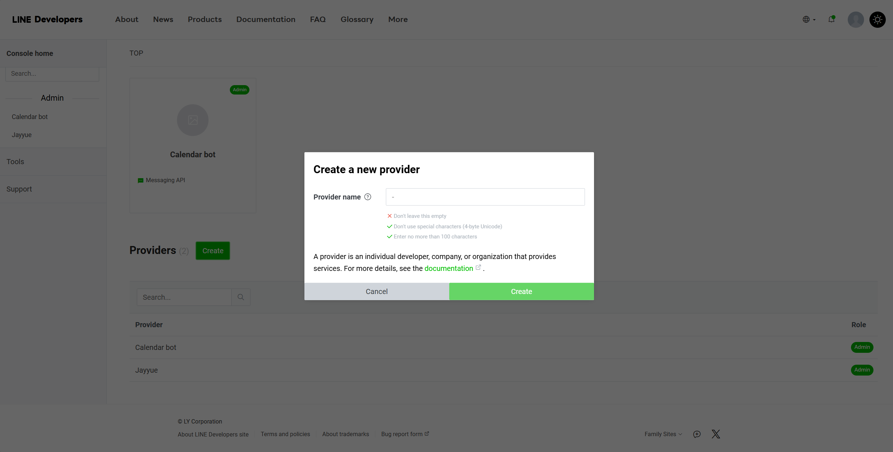

# 動機
有時候在 line 上面跟別人講好日期後，如果沒有將它紀錄下來的話，有時候會忘記，而記錄到日曆又要另外開一個app，非常的麻煩，因此便想說用設計一個Line Bot來處理line上面一些有關日程的留言，並將他自動在Google calendar上設定。

---

# 成果展示
> line對話

> google calendar結果

---

這個專案使用的是以本地架設伺服器以及本地LLM為主，~~因為我很窮~~

# 基本環境要求
建議可以開一個虛擬環境來架設環境，避免環境衝突
## LLM架設
我使用的是[llama.cpp](https://github.com/ggerganov/llama.cpp)的兄弟專案[llama-cpp-python](https://github.com/abetlen/llama-cpp-python)，可以使用以下指令來安裝
```bash
pip install llama-cpp-python
```
### llama-cpp-python官方的使用方法
```python
from llama_cpp import Llama

llm = Llama(
      model_path="./models/7B/llama-model.gguf",
      # n_gpu_layers=-1, # Uncomment to use GPU acceleration
      # seed=1337, # Uncomment to set a specific seed
      # n_ctx=2048, # Uncomment to increase the context window
)
output = llm(
      "Q: Name the planets in the solar system? A: ", # Prompt
      max_tokens=32, # Generate up to 32 tokens, set to None to generate up to the end of the context window
      stop=["Q:", "\n"], # Stop generating just before the model would generate a new question
      echo=True # Echo the prompt back in the output
) # Generate a completion, can also call create_completion
print(output)
```
他的輸出會是
```json
{
  "id": "cmpl-xxxxxxxx-xxxx-xxxx-xxxx-xxxxxxxxxxxx",
  "object": "text_completion",
  "created": 1679561337,
  "model": "./models/7B/llama-model.gguf",
  "choices": [
    {
      "text": "Q: Name the planets in the solar system? A: Mercury, Venus, Earth, Mars, Jupiter, Saturn, Uranus, Neptune and Pluto.",
      "index": 0,
      "logprobs": None,
      "finish_reason": "stop"
    }
  ],
  "usage": {
    "prompt_tokens": 14,
    "completion_tokens": 28,
    "total_tokens": 42
  }
}
```
首先要做的就是設計prompt，這裡根據官方範例格式來撰寫prompt
```
Q: 請根據提供的內容，找出詳細的時間、地點、會議目的，並以給定格式輸出。請確保：
    1. 格式為json格式。
    2. 時間應保持相對時間的形式，並將它轉換成英文與24小時制。
    3. 只需要輸出格式以及他的答案就好。
    4. 請提取出文字內的所有時間，並全部放在"time"的list內，且每個時間應包含開始時間與結束時間。如果文字中只有一個時間，請將開始與結束時間設置為相同。確保日期和時間以"開始日期 開始時間"和"結束日期 結束時間"的形式列出。
    以下為給定的格式：
    {{ "time" : ["開始日期 開始時間", "結束日期 結束時間"], "location" : ["請在這裡輸入地點"], "purpose" : ["請在這裡輸入目的"] }}
    這是需要解析的內容：
    "{message}"
    目前的日期為："{time.strftime('%Y-%m-%d')}"
    \n\rA:
```

可以看到生成內容在裡面的"text"內，所以要使用output['choices'][0]['text']來取得生成內容。

接下來再使用正規表達式來提取出回答中想要的資訊。

完整程式碼
```python
from llama_cpp import Llama
import re
import json
import time


llm = Llama(
    model_path="models\ggml-llama3-1-8b-f16.gguf", # put the path to the model here
    n_gpu_layers=0
)

def get_LLM_response(message: str):
    prompt = f"""
    Q: 請根據提供的內容，找出詳細的時間、地點、會議目的，並以給定格式輸出。請確保：
    1. 格式為json格式。
    2. 時間應保持相對時間的形式，並將它轉換成英文與24小時制。
    3. 只需要輸出格式以及他的答案就好。
    4. 請提取出文字內的所有時間，並全部放在"time"的list內，且每個時間應包含開始時間與結束時間。如果文字中只有一個時間，請將開始與結束時間設置為相同。確保日期和時間以"開始日期 開始時間"和"結束日期 結束時間"的形式列出。
    以下為給定的格式：
    {{ "time" : ["開始日期 開始時間", "結束日期 結束時間"], "location" : ["請在這裡輸入地點"], "purpose" : ["請在這裡輸入目的"] }}
    這是需要解析的內容：
    "{message}"
    目前的日期為："{time.strftime('%Y-%m-%d')}"
    \n\rA:
    """

    output = llm(
        prompt=prompt,
        max_tokens=None,
        stop=["Q:", "\n\rA:", "A:", "\rA:"],
        echo=True
    )
    print("output:",output, "\n")
    result = output['choices'][0]['text']

    result = result.replace("\n", "")
    match_text = re.search(r'\rA:\s*(\{.*?\})', result)
    match_text = match_text.group(1)
    answer = match_text.replace("\rA:", "")
    # 使用正則表達式找到所有的 "time" 部分並將它們提取出來
    time_matches = re.findall(r'"time" : (\[.*?\])', answer)
    # 將所有的時間範圍合併成一個列表
    combined_times = '[' + ', '.join(time_matches) + ']'

    time_matches = re.findall(r'"time"\s*:\s*(\[[^\]]*\])', answer)
    combined_times = '[' + ', '.join(time_matches) + ']'
    answer = re.sub(r'"time"\s*:\s*\[[^\]]*\]\s*,?', '', answer)
    answer = '{ "time" : ' + combined_times + ',' + answer.lstrip('{').rstrip(' }') + ' }'
    print("answer:",answer, "\n")
    answer = json.loads(answer)
    print(type(answer["purpose"]))
    print(answer["purpose"][0])
    
    return answer
```

## Line Bot
1. 首先先去[Line Developers](https://developers.line.biz/en/)，使用Line帳號登入

2. 接下來點擊 Create a Messaging API cannel，填好資料後點 create

3. 接下來就可以在Basic Settings裡面看到Channel secret，Messaging API裡面看到Channel access token(在最下面，要點擊issue才能看到)


4. 安裝[line-bot-sdk](https://github.com/line/line-bot-sdk-python)
```bash
pip install line-bot-sdk
```
- 使用官方範例，並且在handle_message函數內撰寫相關的串接程式碼
```python
from flask import Flask, request, abort
from linebot.v3 import (
    WebhookHandler
)
from linebot.v3.exceptions import (
    InvalidSignatureError
)
from linebot.v3.messaging import (
    Configuration,
    ApiClient,
    MessagingApi,
    ReplyMessageRequest,
    TextMessage
)
from linebot.v3.webhooks import (
    MessageEvent,
    TextMessageContent
)
import os
import datetime
from llm_extract import get_LLM_response
from google_calendar import Google_Calendar

app = Flask(__name__)

with open("lineapi.txt", "r", encoding="utf-8") as f:
    LINEAPI = f.readline().strip()
    WEBHOOK = f.readline().strip()

# 設置Line Messaging API
configuration = Configuration(access_token=LINEAPI)
handler = WebhookHandler(WEBHOOK)


@app.route("/callback", methods=['POST'])
def callback():
    signature = request.headers['X-Line-Signature']
    body = request.get_data(as_text=True)
    app.logger.info("Request body: " + body)

    try:
        handler.handle(body, signature)
    except InvalidSignatureError:
        app.logger.info("Invalid signature. Please check your channel access token/channel secret.")
        abort(400)

    return 'OK'

@handler.add(MessageEvent, message=TextMessageContent)
def handle_message(event):
    with ApiClient(configuration) as api_client:
        line_bot_api = MessagingApi(api_client)
    reply_message = get_LLM_response(event.message.text)
    print(reply_message)
    print(type(reply_message["purpose"]))
    calendar = Google_Calendar()
    try:
        calendar.add_event(reply_message)
        reply = "日曆事件新增成功"
        line_bot_api.reply_message_with_http_info(
            reply_token=event.reply_token,
            messages=[TextMessage(text=reply)])
    except:
        reply = "日曆事件新增失敗"
        line_bot_api.reply_message_with_http_info(
            reply_token=event.reply_token,
            messages=[TextMessage(text=reply)])


if __name__ == "__main__":
    app.run()
```