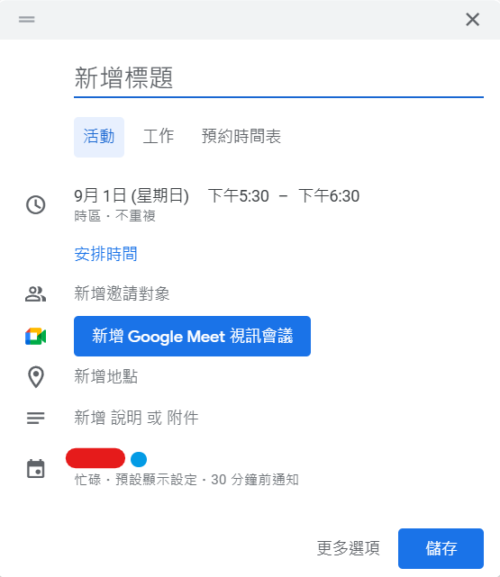
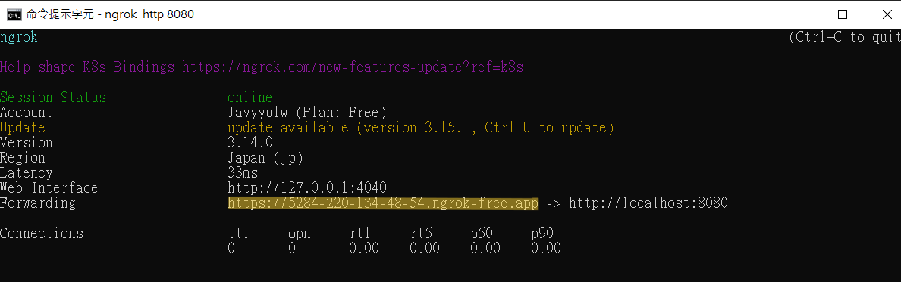
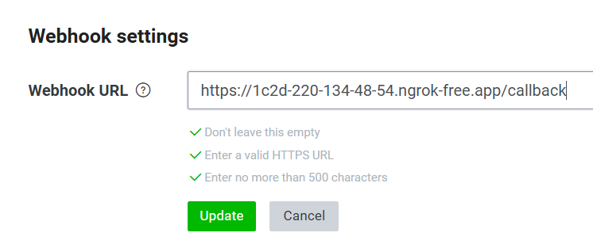
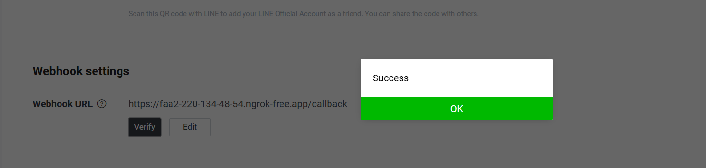

# 前言
在[上一篇](../first/)中，提到了架設了 LLM 跟 Line Bot，不過還沒有串接 Google calendar，還有目前的服務是跑在本地的，無法將訊息傳送到Line Message API來做處理，因此需要一個工具來讓服務在公共網路上也能用。

## Google calendar
[Google calendar API](https://developers.google.com/calendar/api/guides/overview?hl=zh-tw)的串接由於官方已經有非常詳細的說明，所以我這裡只說明我有使用到的東西。

先附上程式碼
```python
import os
from datetime import datetime
from google.auth.transport.requests import Request
from google.oauth2.credentials import Credentials
from google_auth_oauthlib.flow import InstalledAppFlow
from googleapiclient.discovery import build
from googleapiclient.errors import HttpError


# If modifying these scopes, delete the file token.json.
SCOPES = ["https://www.googleapis.com/auth/calendar"]


class Google_Calendar:
    def __init__(self):
        self.creds = None
        self.service = None
        self.service = None
        self.set_creds()
        self.set_service()
    
    def set_creds(self):
        if os.path.exists("token.json"):
            self.creds = Credentials.from_authorized_user_file("token.json", SCOPES)
        if not self.creds or not self.creds.valid:
            if self.creds and self.creds.expired and self.creds.refresh_token:
                self.creds.refresh(Request())
            else:
                flow = InstalledAppFlow.from_client_secrets_file(
                    "credentials.json", SCOPES
                )
                self.creds = flow.run_local_server(port=0)
            with open("token.json", "w") as token:
                token.write(self.creds.to_json())
    
    def set_service(self):
        self.service = build("calendar", "v3", credentials=self.creds)

    def convert_time_to_rfc3339(self, date_time_str):
        dt_iso = datetime.strptime(date_time_str, "%Y-%m-%d %H:%M").isoformat()
        return dt_iso

    def add_event(self, event):
        event["purpose"] = list(event["purpose"])
        for time_range in event["time"]:
            calendar_event = {
                'summary': event["purpose"][0],
                'location': event["location"][0],
                'start': {
                    'dateTime': self.convert_time_to_rfc3339(time_range[0]),
                    'timeZone': 'Asia/Taipei',
                },
                'end': {
                    'dateTime': self.convert_time_to_rfc3339(time_range[1]),
                    'timeZone': 'Asia/Taipei',
                },
                'reminders': {
                    'useDefault': False,
                    'overrides': [
                        {'method': 'popup', 'minutes': 30},
                    ],
                },
            }
            insert_event_result = self.service.events().insert(calendarId='primary', body=calendar_event).execute()
            print('Event created: %s' % (insert_event_result.get('htmlLink')))
```
這裡的程式碼主要是參照[Calendar API快速導覽入門](https://developers.google.com/calendar/api/quickstart/python?hl=zh-tw)中的 quickstart.py 所設置的串接程式碼，接下來就要添加Google calendar事件了，這是Google calendar的事件格式：
```python
event = {
  'summary': 'Google I/O 2015',
  'location': '800 Howard St., San Francisco, CA 94103',
  'description': 'A chance to hear more about Google\'s developer products.',
  'start': {
    'dateTime': '2015-05-28T09:00:00-07:00',
    'timeZone': 'America/Los_Angeles',
  },
  'end': {
    'dateTime': '2015-05-28T17:00:00-07:00',
    'timeZone': 'America/Los_Angeles',
  },
  'recurrence': [
    'RRULE:FREQ=DAILY;COUNT=2'
  ],
  'attendees': [
    {'email': 'lpage@example.com'},
    {'email': 'sbrin@example.com'},
  ],
  'reminders': {
    'useDefault': False,
    'overrides': [
      {'method': 'email', 'minutes': 24 * 60},
      {'method': 'popup', 'minutes': 10},
    ],
  },
}
```
這裡解釋一下每個欄位對應的事件
先附上在Google calendar的新增事件

- summary：標題
- location：地點
- description：說明
- start, end：開始、結束時間
    - 要將時間轉為RFC3339格式與標註時區
- recurrence：重複事件
    - 有規則，可以查看Google calendar文件，這裡目前沒用到
- attendees：邀請對象
    - 填寫邀請人email
- reminders：事件通知
    - useDefault：套用日曆預設通知
    - overrides：這個活動專用的提醒，裡面method可以用email(寄信通知)或是popup(在使用者介面彈出通知)，minutes設定活動開始前幾分鐘通知

## 將服務設置到公共網路做測試
由於目前的服務都是在本地上做運行的，如果要跟line做串接的話是沒有辦法的，因為現在的服務在公共網路上是找不到的，所以這時候有兩種方法，一是租伺服器(自己架、GCP、AWS、Azure)，但是這樣子需要一筆額外的支出，因此我使用了另一個工具叫做[ngrok](https://ngrok.com/)，可以在[這裡](https://ngrok.com/download)下載，透過這個工具我們就可以在公共網路上使用自己的服務。
因為Line Bot已經有開啟一個flask服務了，所以我們就可以使用以下指令來讓ngrok與自己的flask服務溝通
```
ngrok http <flask service URL>
```
在開啟後會跳出這樣的畫面

畫起來的那一段就是ngrok分配的公共網路網址，這個時候就可以將網址放到 line developers 上面的 Webhook URL 了，就像下面的圖，後面的 callback 是因為在 flask 上面有定義一個名為 callback 的 route，並且是在這個 route 的 function 裡運行，因此需要在後面加上 callback。
```python
@app.route("/callback", methods=['POST'])
def callback():
    ...
```

接下來點擊 verify，如果跳出200 OK的話就是沒有問題，可以開始傳送訊息到聊天室了。


最後附上github連結，可以參考看看，之後會考慮使用NER做看看
::github{repo="Jayyyu1w/Calendar-Linebot"}